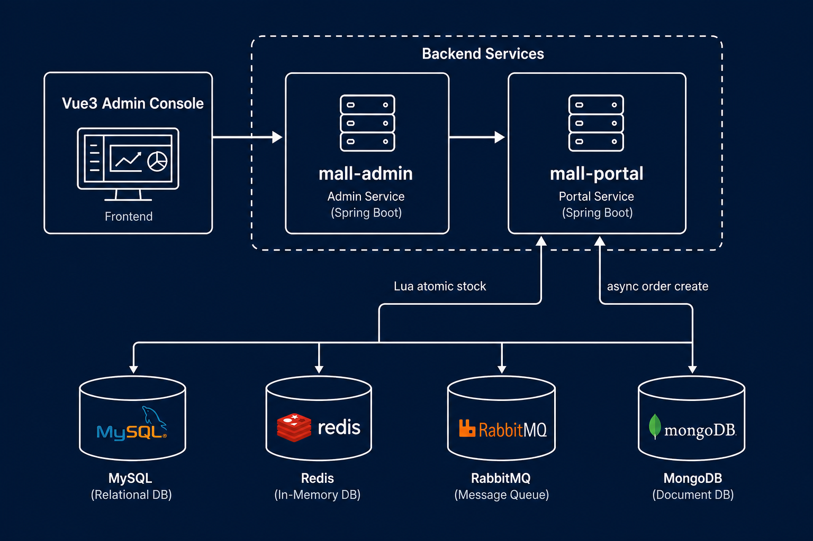
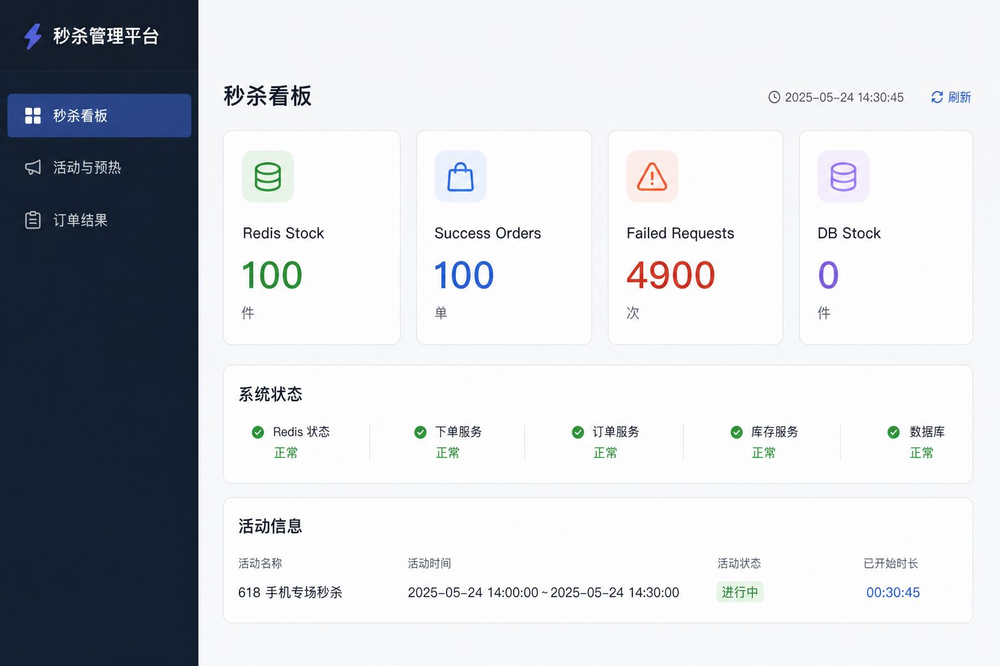
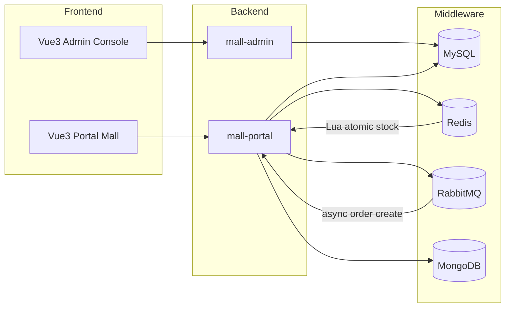

# Mall 全栈电商与高并发秒杀优化项目

基于 [macrozheng/mall](https://github.com/macrozheng/mall) 改造的 **Spring Boot 3 + Vue 3** 全栈项目，面向简历展示、GitHub 作品集和面试演示。重点证明秒杀链路、缓存优化、前后端协作与工程化交付能力。

> **项目边界**：仅用于学习与简历展示，不接入真实支付、不提供生产部署 SLA，也不声称可直接商用。

<p align="center">
  
</p>

<p align="center">
  
</p>

## 核心亮点

- **秒杀链路**：Redis Lua 原子预扣库存 + 限购 + 重复下单校验，RabbitMQ 异步落库，脚本验证零超卖。
- **性能优化**：Redis + Caffeine 两级缓存、SQL 索引、JMeter 压测报告。
- **全栈闭环**：Vue 3 管理端 + 消费者商城端，覆盖登录 → 购物车 → 优惠券试算 → 订单 → 模拟支付。
- **安全修复**：对象归属校验、模拟支付幂等、下单 `X-Request-Id` 幂等、优惠券/库存条件更新。
- **AI 客服**：可切换 mock / OpenAI-compatible provider。

## 技术架构



模块结构：

```text
mall-admin      后台 API（商品/订单/促销/秒杀运营）
mall-portal     前台 API（会员/购物车/订单/秒杀/AI 客服）
mall-admin-vue3 Vue 3 秒杀运营控制台
mall-portal-vue3 Vue 3 消费者商城端
mall-search     Elasticsearch 商品搜索（可选）
```

## 演示截图

架构图与后台控制台见 README 顶部，源文件位于 `document/assets/`：

- `architecture.png` — 系统架构图
- `admin-console.png` — 秒杀运营控制台

## 本地启动

### 1. 依赖

JDK 21 · Maven 3.9+ · Node.js 18+ · MySQL · Redis · RabbitMQ

### 2. 初始化数据库

```powershell
mysql -uroot -proot -e "CREATE DATABASE IF NOT EXISTS mall DEFAULT CHARACTER SET utf8mb4"
Get-Content .\document\sql\mall.sql | mysql -uroot -proot -D mall
Get-Content .\document\sql\seckill_baseline_schema.sql | mysql -uroot -proot -D mall
Get-Content .\document\sql\phase2_performance_indexes.sql | mysql -uroot -proot -D mall
Get-Content .\document\sql\migrations\add_order_sn_unique_index.sql | mysql -uroot -proot -D mall
Get-Content .\document\sql\migrations\add_seckill_manage_resource.sql | mysql -uroot -proot -D mall
```

### 3. 配置环境变量

复制 `.env.example` 为本地环境变量（或在 IDE Run Configuration 中设置）：

```powershell
copy .env.example .env
```

### 4. 启动后端

```powershell
mvn -pl mall-admin spring-boot:run    # http://localhost:8080
mvn -pl mall-portal spring-boot:run   # http://localhost:8085
```

### 5. 启动前端

**管理端（秒杀运营控制台）**

```powershell
cd mall-admin-vue3
npm install
npm run dev    # http://localhost:5173
```

**消费者商城端**

```powershell
cd mall-portal-vue3
npm install
npm run dev    # http://localhost:5174
```

开发环境下，两个前端分别通过 Vite 代理访问后端：

| 前端 | 端口 | API 代理 |
|------|------|----------|
| `mall-admin-vue3` | 5173 | `/api/admin` → `http://localhost:8080` |
| `mall-portal-vue3` | 5174 | `/api/portal` → `http://localhost:8085` |

## 演示账号与模拟支付

| 角色 | 账号 | 密码 | 说明 |
|------|------|------|------|
| 后台管理员 | `admin` | `macro123` | 登录 Vue 控制台（5173） |
| 前台会员 | `test` | `123456` | 登录消费者商城端（5174） |

**模拟支付**：调用 `POST /order/mock-pay/{orderId}`，仅允许支付自己的待付款订单，金额从数据库订单读取，重复支付幂等。

**演示验证码**：固定值 `123456`（演示模式，非真实短信）。

### 两条演示链路

1. **后台秒杀**：登录控制台 → 预热库存 → 提交秒杀 → 查看订单日志 → 运行一致性脚本  
   详见 `document/delivery/demo-script.md`

2. **用户模拟下单**：

```powershell
powershell -ExecutionPolicy Bypass -File document/scripts/user_order_demo.ps1
```

或导入 `document/postman/mall-portal.postman_collection.json`，详见 `document/delivery/user-order-demo.md`。

## 测试与压测

```powershell
# 后端测试
mvn clean test -DskipTests=false

# 前端构建与测试
cd mall-admin-vue3
npm run build
npm run test

cd ../mall-portal-vue3
npm run build
npm run test

# 秒杀一致性验证
powershell -ExecutionPolicy Bypass -File document/scripts/seckill_redis_verify.ps1 -RelationId 1 -InitialStock 100

# 秒杀压测对比
powershell -ExecutionPolicy Bypass -File document/scripts/run_seckill_phase1c.ps1
```

## 已知局限

- **MQ 补偿**：Redis 扣减成功但 MQ 发送失败时的 publisher confirm 补偿尚未实现（见 `document/delivery/review-notes.md`）。
- **缓存失效**：商品编辑后需主动失效热点缓存，当前为 TTL 兜底。
- **支付**：仅模拟支付，支付宝沙箱入口在 `mall.payment.mock-only=true` 时禁用。

## 重要文档

| 文档 | 说明 |
|------|------|
| `document/delivery/local-runbook.md` | 本地运行手册 |
| `document/delivery/demo-script.md` | 秒杀演示脚本 |
| `document/delivery/user-order-demo.md` | 用户下单演示 |
| `document/architecture/optimization-architecture.md` | 优化架构 |
| `document/performance/seckill-phase1c-report.md` | 秒杀压测报告 |

## License

[Apache License 2.0](LICENSE)
