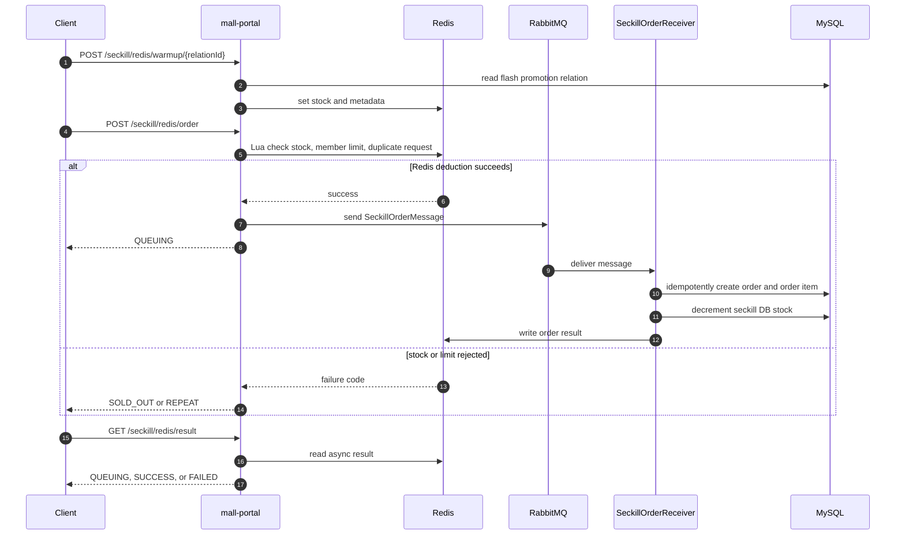
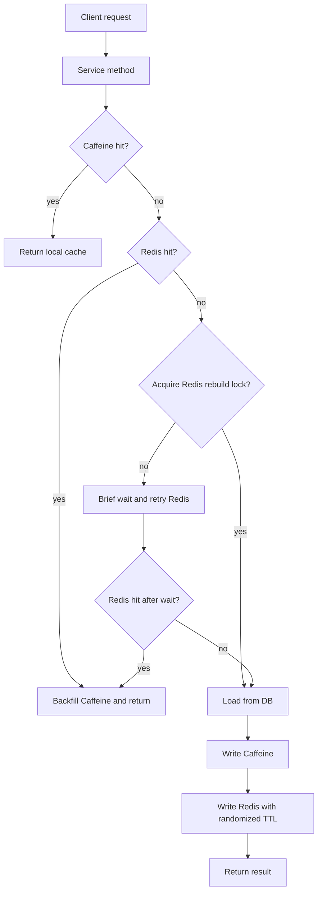

# Optimization Architecture

## Seckill Order Flow

## Hot Read Cache Flow

## Cache Keys

| Data | Key pattern |
| --- | --- |
| Homepage content | `mall:hot:home:content:{minuteBucket}` |
| Recommended products | `mall:hot:home:recommend:{pageNum}:{pageSize}` |
| Hot products | `mall:hot:home:hot:{pageNum}:{pageSize}` |
| New products | `mall:hot:home:new:{pageNum}:{pageSize}` |
| Product detail | `mall:hot:product:detail:{productId}` |
| Product category tree | `mall:hot:product:category-tree` |

## Reliability Notes

- Redis failures in the hot-data cache are degraded to DB load instead of failing the request.
- Null-value cache TTL is short to reduce penetration from invalid IDs.
- Randomized Redis TTL lowers same-time expiration risk.
- The seckill hot path does not use a DB lock for stock deduction; Redis Lua owns the high-concurrency admission decision.
- DB remains the persistent truth after the async consumer creates orders.
