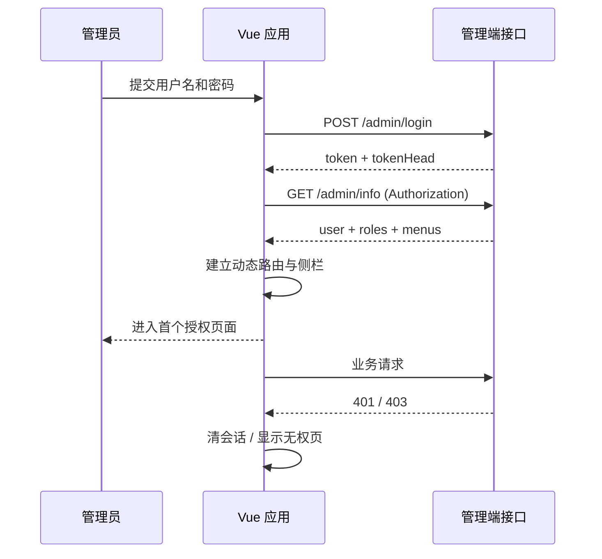

# mall Vue 3 前端完整构建文档

> 适用范围：`mall-master/mall-admin-vue3` 管理运营端的 UI 重构与功能补齐。本文以当前后端接口、已有秒杀管理骨架及 `mall` 的商品/订单/营销/权限领域为依据，提供可直接执行的前端建设方案。

## 1. 结论与边界

应将前端拆为两个独立应用，而不是在同一个项目内通过菜单混合：

| 应用 | 目录 | 使用者 | 首期目标 |
| --- | --- | --- | --- |
| 运营管理端 | `mall-admin-vue3` | 运营、商品、客服、管理员 | 本文的实现主体，补齐后台全部业务闭环 |
| 用户商城端 | `mall-portal-vue3`（已落地） | 消费者 | 商品浏览、搜索、购物车、优惠券试算、下单、个人中心、秒杀 |

当前已有的 `mall-admin-vue3` 具备 Vite、Vue 3、TypeScript、Pinia、Vue Router、Element Plus、Axios 和 Vitest。它已有登录、秒杀活动、秒杀看板、订单日志页面，且代理到 `http://localhost:8080` 的管理接口。因此应**在现有应用上迭代**，不必重新搭建技术栈。

本期 UI 的核心是“运营后台”：桌面优先、响应式可用、信息密度适中、可审计的高风险操作。管理端不承担消费者交易体验；消费者商城端在管理端稳定后按同一领域模型另行建设。

## 2. 目标与验收

### 2.1 业务目标

1. 管理员登录后仅能看到其授权菜单和操作。
2. 商品、分类、品牌、订单、售后、营销、秒杀、用户与权限均有可完成任务的页面，而不只是接口列表。
3. 秒杀活动可以从配置、商品关联、预热、运行监控到订单异常排查形成闭环。
4. 任意列表页都具备查询、分页、加载、空态、失败重试与操作反馈。
5. 高风险写操作（删除、上下架、状态切换、预热）必须确认、显示结果，并保留可追溯入口。

### 2.2 工程验收

- `npm run build` 通过 TypeScript 检查与生产构建。
- `npm test` 通过：鉴权、请求错误处理、权限菜单、一个核心列表页和秒杀预热流程。
- 首屏主包不包含全部业务页面；业务路由采用懒加载。
- Chrome 宽度 1440px、1024px、768px 下无横向溢出；表格在窄屏可横向滚动。
- 所有按钮、输入框有可读文本或无障碍名称；颜色不作为唯一状态表达。

## 3. 现状与需要修正的点

当前实现已具备：

- JWT 登录、退出、本地会话保存；
- Axios 请求拦截器和 401 清会话逻辑；
- Vite `/api/admin` 开发代理；
- 秒杀活动列表、活动商品、预热、统计概览和订单日志；
- Vite 对 Vue、Element Plus、Axios 的基础分包。

需要在首个迭代修正：

1. 将现有 Vue 文件、请求提示中的乱码文本统一保存为 UTF-8；这是用户可见缺陷，应优先处理。
2. 登录后调用 `GET /admin/info`，将后端返回的 `menus`、`roles`、头像写入会话；当前仅保存用户名，菜单是硬编码的。
3. 由后端菜单生成路由与侧栏；前端 route meta 负责页面映射和按钮权限，不以“隐藏按钮”替代后端鉴权。
4. 在请求层补充取消请求、请求序号/幂等键、统一业务错误类型与可重试判断；不要在每个页面手写 `try/finally/message`。
5. 把页面的筛选条件同步到 URL query，保证刷新、复制链接和返回列表时状态可恢复。

## 4. 技术选型

| 层次 | 选择 | 约定 |
| --- | --- | --- |
| 框架 | Vue 3 + Composition API + `<script setup lang="ts">` | 不新增 Options API 页面 |
| 构建 | Vite 6 | 环境变量采用 `VITE_*`，禁止将地址、密钥硬编码到页面 |
| UI | Element Plus | 用 token 与二次封装统一风格；不直接散落覆盖组件样式 |
| 路由 | Vue Router 4 | 静态登录/异常页 + 登录后动态业务路由 |
| 状态 | Pinia | 只存跨页会话、权限、布局偏好、少量业务草稿；列表查询状态以 URL 为准 |
| HTTP | Axios | 一个请求模块、领域 API 文件、DTO 类型和错误模型 |
| 日期/格式 | dayjs | 时间、货币、状态文案在 `utils/format` 集中处理 |
| 图表 | ECharts + `vue-echarts` | 仅看板和趋势图按需加载；普通 KPI 使用轻量统计卡 |
| 测试 | Vitest + Vue Test Utils | 单元/组件测试；端到端可在第二阶段加 Playwright |
| 代码质量 | ESLint + Prettier + Stylelint（建议） | 提交前执行 typecheck、lint、test |

不建议为“完整”而过早引入微前端、全局事件总线、全局大仓库或把后端 DTO 原样散布到视图。它们会降低业务页面迭代速度。

## 5. 信息架构与路由

### 5.1 一级导航

```text
工作台
商品中心
订单与售后
营销中心
会员中心
系统管理
```

### 5.2 页面清单

| 一级模块 | 页面 | 路径 | 对应后端能力 |
| --- | --- | --- | --- |
| 工作台 | 经营概览 | `/dashboard` | 聚合指标接口（需补充） |
| 工作台 | 秒杀运行看板 | `/seckill/dashboard` | `/seckill/manage/summary` |
| 商品中心 | 商品列表/编辑 | `/product/list`、`/product/:id?` | `PmsProductController`、`PmsSkuStockController` |
| 商品中心 | 分类与属性 | `/product/categories`、`/product/attributes` | 分类、属性、属性分类控制器 |
| 商品中心 | 品牌与商品库 | `/product/brands`、`/product/albums` | `PmsBrandController`、上传接口 |
| 订单与售后 | 订单列表/详情 | `/order/list`、`/order/:id` | `OmsOrderController` |
| 订单与售后 | 退货申请/原因/设置 | `/after-sales/*` | `OmsOrderReturnApply/Reason/SettingController` |
| 营销中心 | 秒杀活动 | `/marketing/flash-promotions` | `SmsFlashPromotionController` |
| 营销中心 | 秒杀商品与预热 | `/marketing/flash-promotions/:id/products` | 关联控制器、`/seckill/manage/warmup/{relationId}` |
| 营销中心 | 秒杀订单日志 | `/marketing/seckill-orders` | `/seckill/manage/orderLogs` |
| 营销中心 | 优惠券 | `/marketing/coupons` | `SmsCouponController`、`SmsCouponHistoryController` |
| 营销中心 | 首页内容 | `/marketing/home/*` | 广告、新品、品牌、推荐商品、专题控制器 |
| 会员中心 | 会员等级 | `/member/levels` | `UmsMemberLevelController` |
| 系统管理 | 管理员 | `/system/admins` | `UmsAdminController` |
| 系统管理 | 角色与菜单 | `/system/roles`、`/system/menus` | `UmsRoleController`、`UmsMenuController` |
| 系统管理 | 资源与资源分类 | `/system/resources` | `UmsResourceController`、`UmsResourceCategoryController` |
| 通用 | 登录、403、404 | `/login`、`/403`、`/:pathMatch(.*)*` | `/admin/login`、`/admin/info` |

“经营概览”需由后端提供聚合接口，不应让浏览器并发调用十几个列表接口后自己汇总。建议接口：`GET /dashboard/overview?range=7d`，返回 KPI、订单趋势、待处理售后、库存预警、进行中的活动。它是一个深模块：前端只认识一个稳定的数据结构，聚合规则与缓存策略隐藏在实现内。

### 5.3 路由元数据

每个业务路由必须声明 `title`、`icon`、`permission`、`keepAlive`、`breadcrumb`。页面用后端菜单 `hidden`、`url` 决定是否可见，用 route meta 将菜单 URL 映射为 Vue 页面。未配置的菜单记录为告警并跳转 404，不能静默展示空白页。

```ts
meta: {
  title: '秒杀运行看板',
  icon: 'Lightning',
  permission: 'seckill:manage:read',
  keepAlive: false
}
```

## 6. 页面与 UI 规范

### 6.1 通用布局

- 桌面端：可收起的左侧导航（232px/64px）、固定顶部栏（56px）、面包屑与页签、内容区最大宽度不设死值。
- 平板端：侧栏转为抽屉；内容两列降为一列。
- 手机端：以查看、查询、轻操作为主；复杂商品编辑、角色授权页面提示使用大屏，不强行压缩表单。
- 页面结构固定为：`PageHeader`（标题、说明、主操作）→ `FilterBar` → `DataPanel`（表格/卡片）→ `Pagination`。

### 6.2 视觉 token

```css
:root {
  --color-primary: #1677ff;
  --color-success: #16a34a;
  --color-warning: #d97706;
  --color-danger: #dc2626;
  --color-text: #1f2937;
  --color-muted: #6b7280;
  --color-border: #e5e7eb;
  --color-page: #f5f7fa;
  --radius-card: 12px;
  --space-page: 24px;
}
```

使用 8px 间距体系；数字与金额右对齐；状态统一为标签（成功/进行中/待处理/失败/已关闭），同时提供文字。表格默认密度“舒适”，每页 10/20/50 条；页面可保存个人密度偏好。

### 6.3 核心交互

| 场景 | 交互要求 |
| --- | --- |
| 列表筛选 | 输入 300ms 防抖；点击查询更新 URL；重置回默认 query；搜索期间保留旧数据并显示局部加载 |
| 新建/编辑 | 简单对象用侧边抽屉，商品/活动用独立路由多步表单；离开未保存时二次确认 |
| 删除/状态变更 | Popconfirm 展示对象名和影响；成功后刷新当前页，最后一页删空时回到上一页 |
| 图片上传 | 上传前校验格式、大小、数量；本地预览；失败可单文件重试；服务端 URL 作为最终值 |
| 表格操作 | 主操作可见，次要操作收进“更多”；批量操作仅在已选行时显示 |
| 错误 | 网络错误、权限错误、业务错误分别展示；页面区错误使用 Alert + 重试，不能只弹 Toast |
| 加载/空态 | 首次使用骨架屏；局部刷新使用表格 loading；无数据说明原因并给出创建/重置入口 |

### 6.4 秒杀闭环页面

秒杀不应只是三张孤立页面，建议采用活动详情的二级导航：

```text
活动基本信息 → 场次与商品 → 预热与库存 → 实时运行 → 订单日志
```

- **活动基本信息**：名称、时间、状态、场次；编辑保存后刷新详情。
- **场次与商品**：关联商品、秒杀价、活动库存、限购数、排序；活动库存不得超过可分配库存（后端二次校验）。
- **预热与库存**：显示数据库库存、Redis 库存、key、最后预热时间；预热为危险操作，需二次确认。
- **实时运行**：KPI、库存一致性、请求状态分布；自动刷新间隔 5–10 秒，可暂停；页面不可因刷新抢走用户操作焦点。
- **订单日志**：按状态、会员、请求 ID、订单号、时间筛选，支持复制 requestId；失败原因完整可见。

## 7. 前端分层、目录与模块接口

建议重构为下列目录。领域目录拥有自己的页面、组件、API 和类型；共享层不放具体业务判断。

```text
src/
  app/                 # AppShell、应用初始化、全局 provider
  api/
    http/              # axios 实例、错误模型、请求取消、unwrap
    modules/           # auth.ts、product.ts、order.ts、marketing.ts、system.ts
  assets/
  components/
    base/              # BaseTable、PageHeader、FilterBar、StatusTag、EmptyState
    business/          # ProductPicker、ImageUploader、PermissionTree
  composables/         # useListQuery、useAsyncTask、usePermission、useAutoRefresh
  constants/           # 路由、状态枚举、字典 key
  layouts/             # AdminLayout、BlankLayout
  router/              # static routes、dynamic routes、guards、route mapper
  stores/              # auth、permission、app、preference
  styles/              # tokens.css、reset.css、element-overrides.css
  types/               # common.ts、menu.ts、pagination.ts
  utils/               # format、validate、download、storage
  views/
    dashboard/
    product/
    order/
    marketing/
    member/
    system/
    exception/
```

关键模块的接口应小而稳定：

| 模块 | 调用方只需知道 | 内部隐藏内容 |
| --- | --- | --- |
| `authStore` | `signIn`、`bootstrap`、`signOut`、`hasPermission` | token 存储、用户信息加载、会话清理 |
| `permissionStore` | `initializeMenus`、`routes`、`can` | 菜单树标准化、菜单 URL 映射、动态 addRoute |
| `useListQuery` | `query`、`tableData`、`page`、`search/reset/reload` | URL 同步、防抖、取消旧请求、加载和错误状态 |
| `useAsyncTask` | `run`、`loading`、`error` | 重复点击保护、成功/失败反馈、错误分类 |
| `api/modules/*` | 领域语义方法和 DTO | URL、HTTP method、`CommonResult` 解包 |

这样页面不直接操作 Axios、localStorage 或菜单树，复杂性集中在少数模块，后续迁移接口或修改认证方式时只改一个位置。

## 8. 状态、鉴权与安全

### 8.1 状态归属

| 状态 | 存放位置 | 持久化 |
| --- | --- | --- |
| access token、当前用户、角色、菜单 | `authStore`/`permissionStore` | token 可持久化；用户信息每次启动重新拉取 |
| 侧栏收起、主题、表格密度 | `preferenceStore` | localStorage |
| 列表筛选、页码、排序 | route query | URL |
| 表单编辑草稿 | 页面/领域 store | 默认不持久化；明确需要恢复时才存 sessionStorage |
| 表格数据、详情数据 | 页面 `ref` 或查询缓存 | 不进全局 store |

### 8.2 鉴权流程



- token 放内存与 `sessionStorage` 优先；如产品要求“关闭浏览器后仍登录”再改为 localStorage，并接受 XSS 风险。
- 所有写请求在界面层防重复提交；需要跨重试幂等的订单/预热类请求由后端支持 `X-Request-Id`。
- 前端权限仅用于体验；后端 Spring Security 与资源权限才是最终裁决。
- 禁止在前端保存数据库密码、云密钥、完整用户敏感信息。日志中对 token、手机号、地址做脱敏。

## 9. API 契约与错误处理

后端当前统一结果为 `CommonResult<T>`，分页为 `{ pageNum, pageSize, total, list }`。前端统一转换为以下形态，业务页面不得关心包裹结构：

```ts
export interface Page<T> {
  pageNum: number
  pageSize: number
  total: number
  totalPage?: number
  list: T[]
}

export class ApiError extends Error {
  constructor(
    readonly kind: 'network' | 'unauthorized' | 'forbidden' | 'business' | 'unknown',
    message: string,
    readonly code?: number,
  ) { super(message) }
}
```

规范：

- API 文件按领域而非页面命名，例如 `marketing.ts` 提供 `listFlashPromotions`、`warmupSeckill`。
- 请求参数与响应 DTO 放在同一领域 `types.ts`；显示字段通过 ViewModel 或 format 函数处理。
- `401`：清空会话并带 `redirect` 回登录页；`403`：跳转 403 页；网络错误：当前区域允许重试；业务错误：展示服务端 message。
- 列表搜索更换条件时取消前一个请求，避免慢响应覆盖新结果。
- 上传走 `OssController`/`MinioController` 的稳定适配层；UI 不依赖具体对象存储实现。

## 10. 实施阶段

| 阶段 | 交付物 | 主要内容 | 完成标准 |
| --- | --- | --- | --- |
| 0：基线（1–2 天） | 可持续开发的壳 | UTF-8 修复、环境变量、lint/format、全局 token、异常页、设计 token | build/test 通过，登录与退出稳定 |
| 1：基础设施（2–3 天） | 统一应用框架 | `AdminLayout`、动态菜单、权限守卫、`useListQuery`、请求错误模型、通用组件 | 新列表页不重复写分页和错误逻辑 |
| 2：秒杀闭环（3–5 天） | 完整活动运营流 | 活动详情二级导航、商品关联、预热确认、实时看板、日志筛选 | 可从活动配置追踪至订单结果 |
| 3：商品与订单（5–8 天） | 核心运营能力 | 商品/分类/品牌/SKU、订单详情、发货、售后 | 商品到订单操作链路可演示 |
| 4：营销与系统（4–6 天） | 后台完整度 | 优惠券、首页推荐、管理员、角色、菜单、资源 | 权限控制可验证，管理页面可用 |
| 5：质量与发布（2–3 天） | 可发布构建 | 响应式检查、a11y、性能、错误监控、CI、Nginx 部署 | 验收清单全绿 |

建议交付节奏：每个阶段结束都有一个可演示分支，不等待全部页面完成才联调。优先实现“用户能完成一件事”的垂直切片，而不是先把所有菜单铺完。

## 11. 测试、性能与发布

### 11.1 最小测试矩阵

| 类型 | 覆盖对象 | 示例 |
| --- | --- | --- |
| 单元测试 | `authStore`、错误转换、格式化、权限判断 | 401 后会话清理；无权限返回 false |
| 组件测试 | `BaseTable`、`FilterBar`、`StatusTag` | loading/empty/error 状态正确显示 |
| 页面测试 | 秒杀预热、活动列表、订单日志 | 提交筛选参数、二次确认、成功后刷新 |
| E2E | 登录、配置秒杀商品、预热、查询日志 | 以 mock 或测试环境后端执行完整路径 |
| 手工验收 | 权限、窄屏、键盘、网络异常 | 无横向溢出、焦点可见、错误可恢复 |

### 11.2 性能要求

- 路由页面和 ECharts 按需加载；商品编辑器、图片上传器不进入首屏。
- 列表 50 条以内使用普通表格；超过数百行才引入虚拟表格，避免不必要复杂度。
- 图片使用缩略图 URL、懒加载和失败占位；不把原图直接塞入表格。
- 自动刷新仅用于秒杀运行页，离开页面立即停止；标签页不可见时暂停。
- 通过 `npm run build` 审查 chunk；过大依赖优先动态导入而非盲目提升阈值。

### 11.3 环境与部署

```text
.env.development      VITE_API_BASE_URL=/api/admin
.env.staging          VITE_API_BASE_URL=https://staging.example.com/api/admin
.env.production       VITE_API_BASE_URL=/api/admin
```

Vite 产物部署到 Nginx 静态目录；Nginx 对 `/api/admin` 反向代理至管理端服务，对 Vue history 路由配置 `try_files $uri $uri/ /index.html`。发布前注入版本号/提交号，用于问题定位；不要把源码 map 无限制公开到生产环境。

CI 最小流程：安装锁定依赖 → `npm run build` → `npm test` → 产出 `dist` → 部署测试环境 → E2E/人工冒烟 → 发布。

## 12. 后端协作清单

前端可立即使用现有秒杀、商品、订单、营销和权限控制器；为获得完整运营体验，建议同步确认或补充以下契约：

1. `GET /dashboard/overview`：返回已聚合的运营 KPI 和趋势，避免前端拼装。
2. 所有列表接口统一 `pageNum/pageSize/keyword/sort`，统一分页字段与时间格式。
3. 所有写操作明确成功数据、校验错误结构和权限错误状态码。
4. 商品编辑接口提供完整详情 DTO（SPU、SKU、属性、阶梯价、满减、图片），不让前端拼多个查询接口。
5. 订单详情、发货、关闭、售后审核操作的状态机与可操作条件由后端返回，前端仅渲染允许动作。
6. 秒杀预热/取消预热、库存一致性检查提供操作结果和可追溯 requestId；前端展示而不自行推断最终状态。
7. 管理员 `GET /admin/info` 返回菜单 URL、标题、排序、隐藏标志以及资源权限编码；菜单数据作为前端动态路由来源。

## 13. 开始编码的首批任务

1. 修复 `src/views` 与 `src/api/request.ts` 中的 UTF-8 中文文案。
2. 扩展 `src/api/auth.ts` 和 `src/stores/auth.ts`：实现 `getCurrentAdminInfo()`、`bootstrap()`、角色与菜单持久化策略。
3. 创建 `permissionStore`、路由映射、403 页面，并改造 `LayoutView` 使用动态侧栏。
4. 建立 `PageHeader`、`FilterBar`、`BaseTable`、`StatusTag` 与 `useListQuery`；先迁移现有秒杀列表，验证抽象是否足够。
5. 将秒杀三页改造成“活动详情—运行监控—订单日志”的闭环，再按商品、订单、营销、系统顺序拓展。

完成上述五项后，前端将从演示型管理页成长为可持续补齐业务的运营平台，新增模块只需接入领域 API、路由配置和少量业务组件，而不必反复复制登录、表格、权限和错误处理逻辑。
